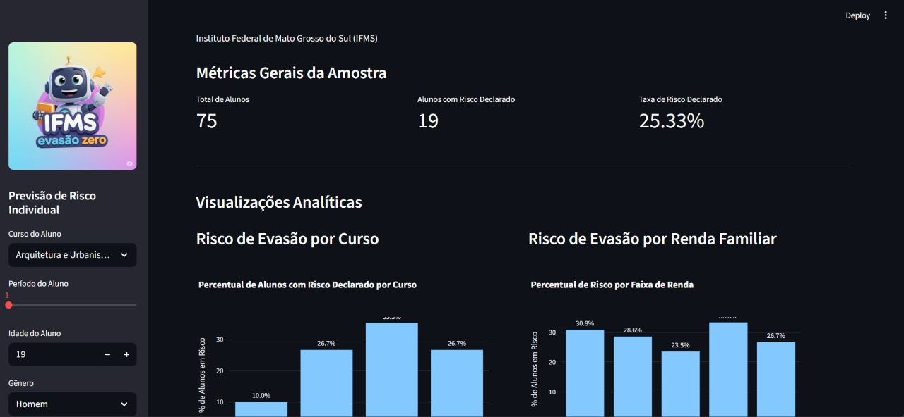

# 📊 EVASÃO-ZERO - Dashboard Preditivo de Evasão Estudantil

<p align="center">
  
</p>

---

## 🎯 Sobre o Projeto

**EVASÃO-ZERO** é uma aplicação de *Data Science* e *Machine Learning* desenvolvida para identificar precocemente estudantes do **Instituto Federal de Mato Grosso do Sul (IFMS)** com risco de evasão.  

A ferramenta principal é um **dashboard interativo** construído com **Streamlit**, que fornece insights à gestão acadêmica, permitindo a implementação de ações **proativas e personalizadas** de apoio ao estudante.

<details>
  <summary><b>📺 Clique para ver a demonstração da aplicação</b></summary>
  <br>
  <p align="center">
    
  </p>
</details>

---

## ✨ Principais Funcionalidades

- 📈 **Análises Visuais** → Gráficos interativos sobre os fatores correlacionados à evasão.  
- 📊 **Métricas Chave (KPIs)** → Resumo do cenário atual da amostra de dados.  
- 🤖 **Modelo Preditivo em Tempo Real** → Simulação do perfil de um aluno com predição instantânea do risco de evasão.  

---

## 📂 Estrutura do Projeto

## 📂 Estrutura do Projeto

| Pasta/Arquivo     | Descrição                                      |
|-------------------|------------------------------------------------|
| 📂 `assets/`      | Imagens, GIFs e logos                          |
| 📂 `data/`        | Conjunto de dados utilizados                   |
| 📂 `dashboard/`   | Código do Streamlit (aplicação principal)       |
| 📂 `notebooks/`   | Notebooks de análise e treinamento do modelo    |
| 📜 `README.md`    | Documentação do projeto                         |


---

## 🛠️ Tecnologias Utilizadas

- **Linguagem:** Python 3.8+  
- **Análise e Manipulação de Dados:** `pandas`, `numpy`  
- **Machine Learning:** `scikit-learn`, `imbalanced-learn`, `joblib`  
- **Visualização e Dashboard:** `streamlit`, `plotly`, `matplotlib`, `seaborn`  

---

## 🚀 Como Executar o Projeto

Siga os passos abaixo para rodar a aplicação em ambiente local:

### 1. Pré-requisitos

- Python 3.8 ou superior  
- `pip` e `venv`

### 2. Instalação e Execução

**a. Clone o repositório:**

```bash
git clone https://github.com/seu-usuario/evasao-zero.git
cd evasao-zero
b. Crie o ambiente virtual e instale as dependências:

bash
Copiar código
# Crie e ative o ambiente
python -m venv venv
source venv/bin/activate  # macOS/Linux
.\venv\Scripts\activate   # Windows

# Instale as bibliotecas
pip install -r dashboard/requirements.txt
c. Prepare os dados e o modelo:
Coloque o arquivo planilha_original.csv dentro da pasta data/.
Em seguida, execute os notebooks:

01_limpeza_e_analise.ipynb

02_treinamento_do_modelo.ipynb

Isso irá gerar os arquivos necessários para o dashboard.

d. Inicie o Dashboard:

bash
Copiar código
streamlit run dashboard/app.py
A aplicação será aberta automaticamente no navegador padrão. 🎉

