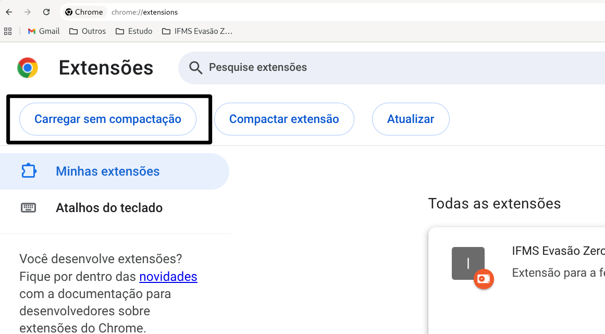
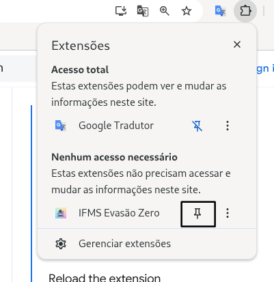
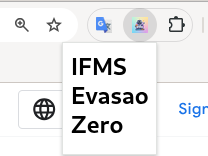

# 🚀 Como Utilizar a Extensão

## 1️⃣ Clonar o Repositório

```bash
git clone <https://github.com/KatSilvax/evasao-zero.git>
```

## 2️⃣ Carregar a Extensão no Chrome

Para carregar a extensão no modo desenvolvedor:

1. Acesse `chrome://extensions`

2. Ative a opção **Modo do desenvolvedor**

3. Clique em **Carregar sem compactação**

4. Selecione o arquivo **manifest.json**

### 📸 Exemplo



## 3️⃣ Fixar a Extensão na Barra

📌 Clique no ícone de “pino” para fixar a extensão na barra do Chrome.



## 4️⃣ Clicar na Extensão

Clique no ícone da extensão para abrir o painel.



📚 Documentações Consultadas

<https://developer.chrome.com/docs/extensions/get-started/tutorial/hello-world>
